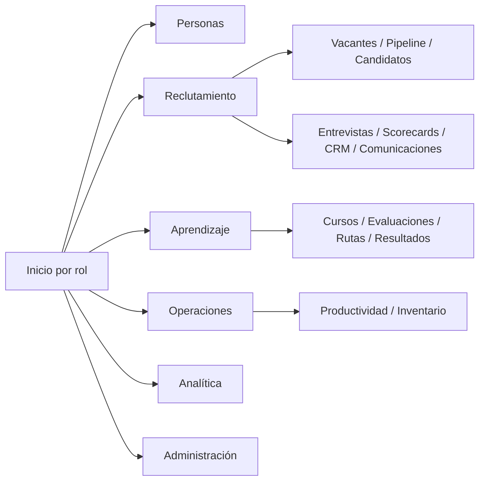
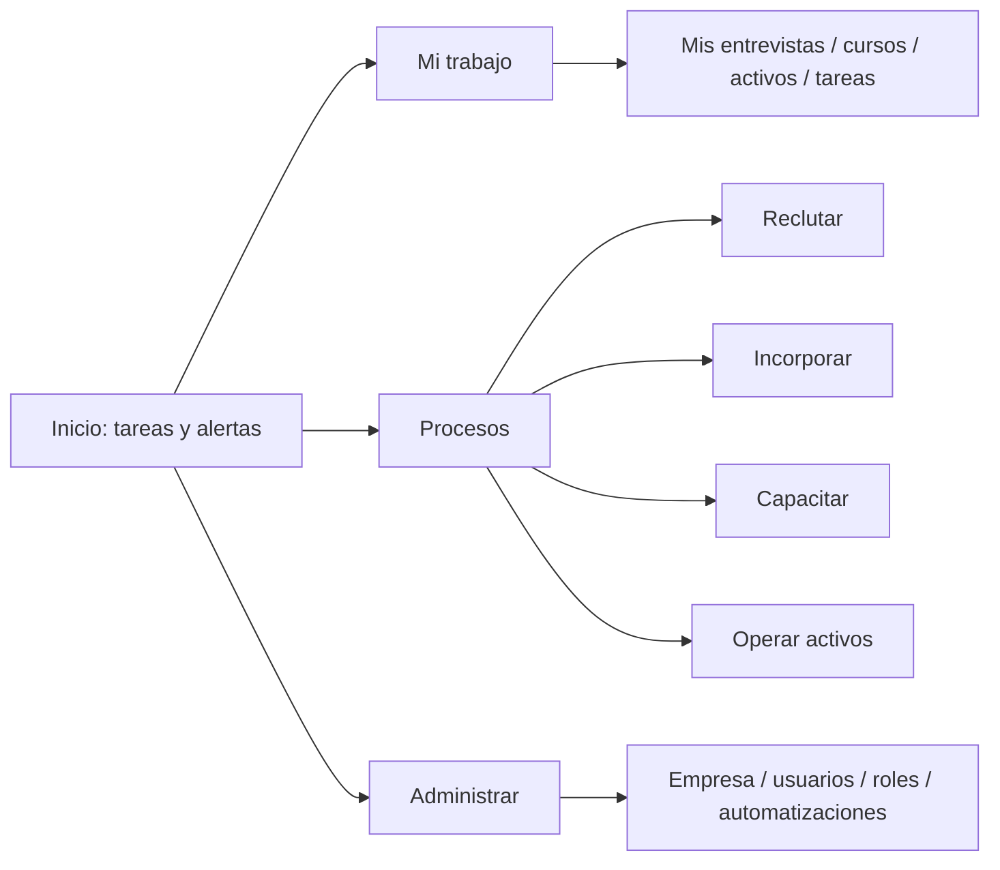

# Auditoría de Primer Uso

## Puntuación por rol

| Rol | Score | Qué entiende rápidamente | Fricción principal | Siguiente mejora |
| --- | ---: | --- | --- | --- |
| Superadministrador | 68 | Empresas, planes, módulos y suscripciones. | Destinos SaaS informativos sin operación. | Completar o ocultar capability pages. |
| Administrador de empresa | 78 | Sucursales, usuarios, roles y automatizaciones. | Configuración inicial no está guiada como checklist. | Asistente de puesta en marcha. |
| RRHH / Reclutador | 80 | Vacantes, candidatos, pipeline y entrevistas. | Decisiones repartidas y vocabulario técnico. | Navegación de proceso y detalle de candidato por tareas. |
| Entrevistador | 76 | Entrevistas y scorecards asignados. | Puede no distinguir trabajo propio de operación completa. | Inicio "Mis entrevistas" y "Pendientes de evaluar". |
| Instructor | 76 | Cursos, rutas, evaluaciones y certificados. | Editor y administración de contenido densos. | Plantillas y creación guiada. |
| Supervisor | 70 | Productividad, inventario y equipo. | Directorio de empleados no es operativo. | Bandeja de equipo y tareas delegadas. |
| Encargado de inventario | 75 | Catálogo, almacén, compras y mantenimiento. | Flujo de entrega/recepción exige navegar entre entidades. | Cronología del activo y acciones contextuales. |
| Empleado | 74 | Cursos, certificados, activos y perfil. | Pendientes intermodulares no se concentran siempre. | Panel "Mi día". |
| Candidato | 84 | Postular, guardar datos de sesión, seguir estado y privacidad. | Agenda no permite alternativas posteriores desde el token. | Reprogramación y mensajes. |

## Navegación actual

## Navegación recomendada

## Tareas que deben ser evidentes sin capacitación

1. **Crear vacante:** CTA "Nueva vacante" visible en Vacantes y configuración guiada.
2. **Mover candidato:** Pipeline con decisión y motivo próximos a la candidatura.
3. **Completar onboarding:** progreso, bloqueos y siguiente responsable en el expediente.
4. **Asignar curso:** CTA en curso/ruta y confirmación del público afectado.
5. **Entregar activo:** CTA en detalle del activo con persona, evidencia y fecha.

## Problemas de descubribilidad

| Función | Estado | Motivo | Corrección |
| --- | --- | --- | --- |
| Exportar | Moderada | Vive en tablas y depende del listado. | Mostrar junto a contador de resultados. |
| Vistas guardadas ATS | Moderada | Compiten con filtros y tabla. | Separar en selector de vista. |
| Clonar/archivar vacante | Moderada | Acción secundaria en tarjeta/detalle. | Menú "Más acciones" consistente. |
| Automations | Difícil | Términos técnicos y formulario largo. | Plantillas de regla por objetivo. |
| Cambiar empresa/sucursal | Moderada | Está en contexto de cabecera, no en flujo. | Confirmación de impacto y persistencia visible. |
| Funciones SaaS placeholder | Engañosa | Parecen disponibles por tener ruta. | Etiquetar "En preparación" u ocultarlas. |
