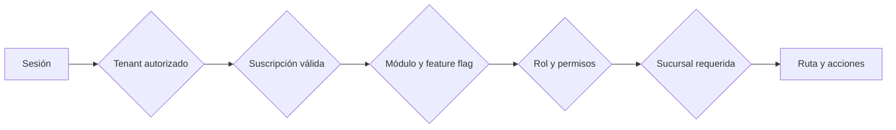

# Mapa de navegación y acceso

## Política actual

`AppShell` evalúa cada ruta registrada en `src/lib/navigation.ts` con: sesión, tenant permitido, contexto global, estado de suscripción, módulo, feature flag, rol, permisos efectivos y sucursal. En caso de denegación muestra una razón humana, no una pantalla rota.

## Mapa actual

```mermaid
flowchart TD
  Inicio[Inicio] --> Dashboard
  Personas --> Empleados
  Personas --> Incorporaciones
  Personas --> Firmas
  Reclutamiento --> Vacantes
  Reclutamiento --> Candidatos
  Reclutamiento --> Entrevistas
  Reclutamiento --> AnaliticaATS[Analítica ATS]
  Aprendizaje --> Cursos
  Aprendizaje --> Evaluaciones
  Aprendizaje --> Resultados
  Aprendizaje --> GestionCursos[Gestionar cursos]
  Operaciones --> Productividad
  Operaciones --> Camaras[Cámaras y zonas]
  Operaciones --> Inventario
  Analitica --> Reportes
  Analitica --> Alertas
  Administracion --> Empresa
  Administracion --> Sucursales
  Administracion --> Usuarios
  Administracion --> Roles
```

## Problemas detectados

- Pipeline, Talent CRM, Comunicaciones y Scorecards existen pero están ocultos de la navegación principal.
- La entrada "Incorporaciones" conduce a documentos, no a una bandeja de trabajo con prioridades.
- En móvil se muestran tres accesos rápidos a partir de ruta/grupo activo. Es correcto como mínimo, pero no garantiza las tres tareas más frecuentes de cada rol.
- Las rutas marcadas `available: false` comparten el catálogo con las activas; deben excluirse de toda navegación y command palette.

## Mapa recomendado

### Tenant admin

`Inicio` → `Bandeja de empresa` → `Personas` (equipo, onboarding) → `Reclutamiento` (vacantes, pipeline, entrevistas) → `Aprendizaje` → `Operaciones` → `Analítica` → `Configuración`.

### Recruiter

`Mi pipeline` → `Candidatos` → `Entrevistas` → `Vacantes` → `Comunicaciones` → `Talent CRM` → `Analítica ATS`.

### Inventory manager

`Operación de hoy` → `Inventario` → `Entregas` → `Devoluciones` → `Escanear` → `Compras` → `Mantenimiento` → `Auditoría`.

### Candidato

`Mi proceso` → `Entrevistas` → `Oferta/documentos` → `Preboarding` → `Perfil y privacidad`.

## Reglas de diseño

1. No mostrar navegación que no termine una tarea real en producción.
2. Cada grupo debe tener una única entrada de bandeja/overview.
3. Las funciones secundarias se descubren mediante contexto, "Ver más" y comando global.
4. Los permisos controlan visibilidad, pero el backend vuelve a autorizarlos.
5. En móvil: máximo cinco accesos directos, menú completo en drawer y CTA de tarea actual visible.
